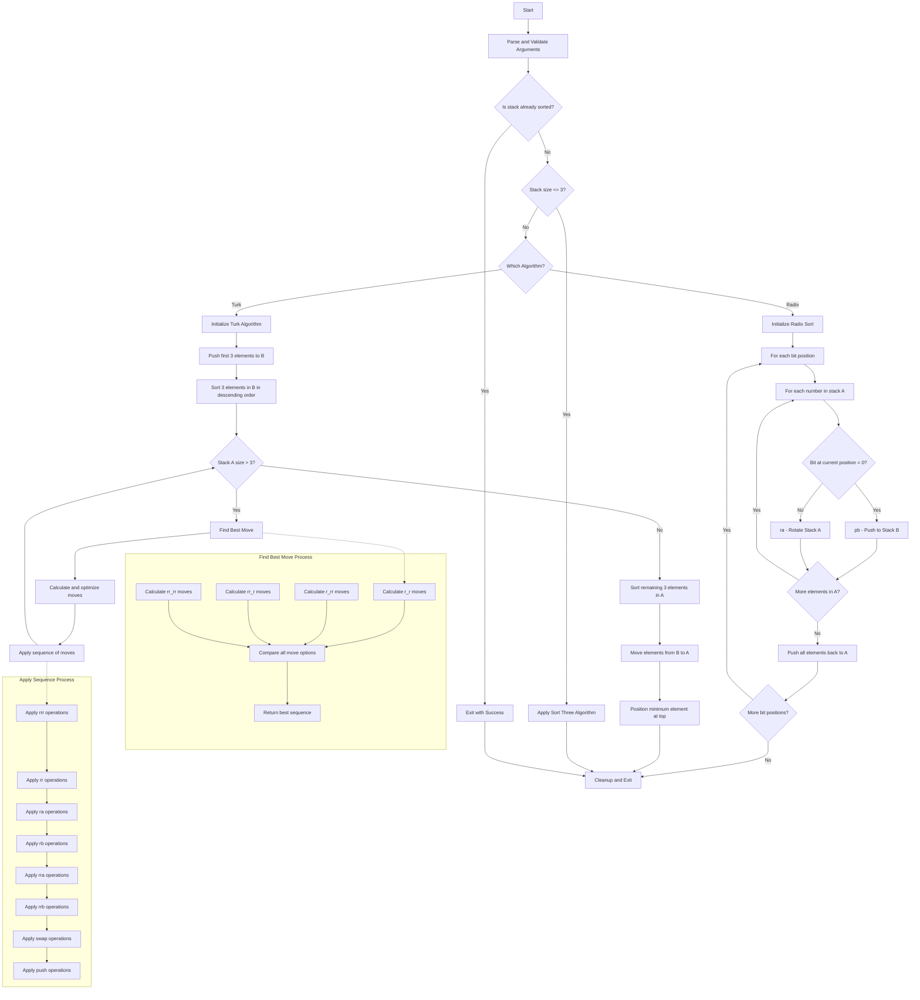

# Push Swap

The Push Swap project is about creating a sorting algorithm using two stacks (A and B) and a limited set of operations. The goal is to sort a randomly ordered stack of integers in ascending order with the minimum number of operations.

**Table of contents**
- [Features](#-Features)
- [Building and Usage](#-Building-and-Usage)
- [Implementation Details](#-Implementation-Details)
	- [Data Structures](#-Data-Structures)
	- [Allowed Operations](#-Allowed-operations)
	- [Algorithms](#-Algorithms)
	- [Project structure](#-Project-Structure)
	- [Flowchart](#-Flowchart)
- [References](#-References)


## 🚀 Features

- **Multiple Sorting Algorithms**: Implements both Radix sort and Turkish (Turk) algorithm for different scenarios
- **Circular Double Linked List**: Uses an optimized data structure for stack operations
- **Optimized Move Selection**: Calculates optimal moves to minimize operations
- **Error Handling**: Validates input and handles edge cases
- **Memory Management**: Implements proper allocation and deallocation of memory

## 🛠️ Building and Usage

```bash
# Clone the repository
git clone https://github.com/yourusername/push_swap.git
cd push_swap

# Build the project
make

# Run the program
./push_swap 5 2 3 1 4
```

### Example Output

```
pb
pb
pb
rra
sa
pa
pa
pa
```

These commands would sort the initial array [5, 2, 3, 1, 4] to [1, 2, 3, 4, 5].

### Algorithm Options
The project implements two sorting algorithms:

- **Turkish Algorithm** (default): Optimized for smaller sets, produces fewer operations
- **Radix Sort**: Efficient for larger sets, with predictable performance

Switch between them during compilation:
```bash
# Use Turkish Algorithm
make turk

# Use Radix Sort
make radix
```

### Using the Checker
The checker program validates whether a sequence of operations correctly sorts the stack:
```bash
# Manual validation
./checker 5 2 3 1 4
# Then enter operations one by one (sa, pb, ra, etc.), end with Ctrl+D

# Pipe push_swap output to checker
./push_swap 5 2 3 1 4 | ./checker 5 2 3 1 4
# Should output "OK" if the operations correctly sort the stack
```

## 💻 Implementation Details

### 📚 Data Structures

The project uses a circular doubly linked list to represent the stacks:

```c
typedef struct s_stack
{
    int             num;    // The actual number
    int             index;  // Index
    struct s_stack  *next;  // Pointer to the next element
    struct s_stack  *prev;  // Pointer to the previous element
} t_stack;
```

### 📋 Allowed Operations

- `sa` (swap a): Swap the first 2 elements of stack A
- `sb` (swap b): Swap the first 2 elements of stack B
- `ss`: `sa` and `sb` at the same time
- `pa` (push a): Take the first element from B and put it at the top of A
- `pb` (push b): Take the first element from A and put it at the top of B
- `ra` (rotate a): Shift up all elements of stack A by 1. The first element becomes the last one.
- `rb` (rotate b): Shift up all elements of stack B by 1. The first element becomes the last one.
- `rr`: `ra` and `rb` at the same time
- `rra` (reverse rotate a): Shift down all elements of stack A by 1. The last element becomes the first one.
- `rrb` (reverse rotate b): Shift down all elements of stack B by 1. The last element becomes the first one.
- `rrr`: `rra` and `rrb` at the same time

### 📊 Algorithms

#### Radix Sort Algorithm
For large stacks, a binary radix sort is implemented. This algorithm sorts numbers by looking at their individual bits from least significant to most significant.

#### Turkish Algorithm
For medium-sized stacks, a more complex but efficient algorithm is used. It:
1. Moves the first 3 elements to stack B and sorts them
2. For each remaining element in A, calculates the cost of moving it to the correct position in B
3. Executes the move with the lowest cost
4. Once only 3 elements remain in A, sorts them
5. Moves all elements back from B to A in the correct order

#### Small Stacks Optimization
For 3 or fewer elements, a specialized sorting function is used to minimize operations.

### 🏗️ Project Structure

```
push_swap/
├── src/
│   ├── main.c                         # Entry point
│   ├── stack/                         # --Stack operations--
│   │   ├── stack_push_pop.c           # Push and pop operations
│   │   ├── stack_manager.c            # Stack creation and management
│   │   ├── stack_min_max.c            # Functions to find min/max values
│   │   └── stack_check_sorted.c       # Functions to check if stack is sorted
│   ├── rules/                         # --Implementation of allowed operations--
│   │   ├── rule_push.c                # Push operations
│   │   ├── rule_swap.c                # Swap operations
│   │   ├── rule_rotate.c              # Rotate operations
│   │   └── rule_reverse_rotate.c      # Reverse rotate operations
│   ├── utils/                         # --Utility functions--
│   │   ├── fill_stack.c               # Functions to fill stack with input
│   │   ├── parse_arguments.c          # Input validation
│   │   ├── sequence_manager.c         # Manage operation sequences
│   │   └── sort.c                     # Basic sorting operations
│   ├── turk_algorithm/                # --Turkish algorithm implementation--
│   │   ├── turk_algorithm.c           # Main algorithm
│   │   ├── best_move.c                # Calculate best move
│   │   └── calculate_moves.c          # Move calculation helpers
│   └── radix_sort_algorithm/          # --Radix sort algorithm implementation--
│       └── radix_algorithm.c          # Radix sort algorithm
├── includes/                          # --Header files--
│   ├── push_swap.h                    # Main header file with core declarations
│   ├── stack.h                        # Stack structure and operations
│   ├── checker_bonus.h                # Main header for the checker
│   ├── ft_printf_bonus.h              # Printf library
│   ├── get_next_line.h                # Get next line library
│   ├── libft.h                        # Libft library
├── libftprintf/                       # --Libft | Printf | GNL--
```

### 🔍 Flowchart

	
## 🔗 References

**Where to start**:
- [Algorithms videos](https://www.youtube.com/watch?v=h1Bi0granxM)
- Grokking Algorithms: An Illustrated Guide for Programmers and Other Curious People
- [First idea](https://m4nnb3ll.medium.com/my-journey-to-find-a-good-sorting-algorithm-for-the-push-swap-42-project-4a18bc38b474)
- [Turk Algorithm](https://medium.com/@ayogun/push-swap-c1f5d2d41e97)
- [Radix Sort](https://medium.com/nerd-for-tech/push-swap-tutorial-fa746e6aba1e)
- [About structure and optimizatons](https://medium.com/@ulysse.gerkens/push-swap-in-less-than-4200-operations-c292f034f6c0)

**Usefull resources**
- [Generator random numbers](https://numbergenerator.org/randomnumbergenerator#!numbers=500&low=-2147483648&high=2147483647&unique=true&csv=&oddeven=&oddqty=0&sorted=false&addfilters=)
- [Push swap visualizer](https://push-swap42-visualizer.vercel.app/)


[Back to TOP](#Push-Swap)

